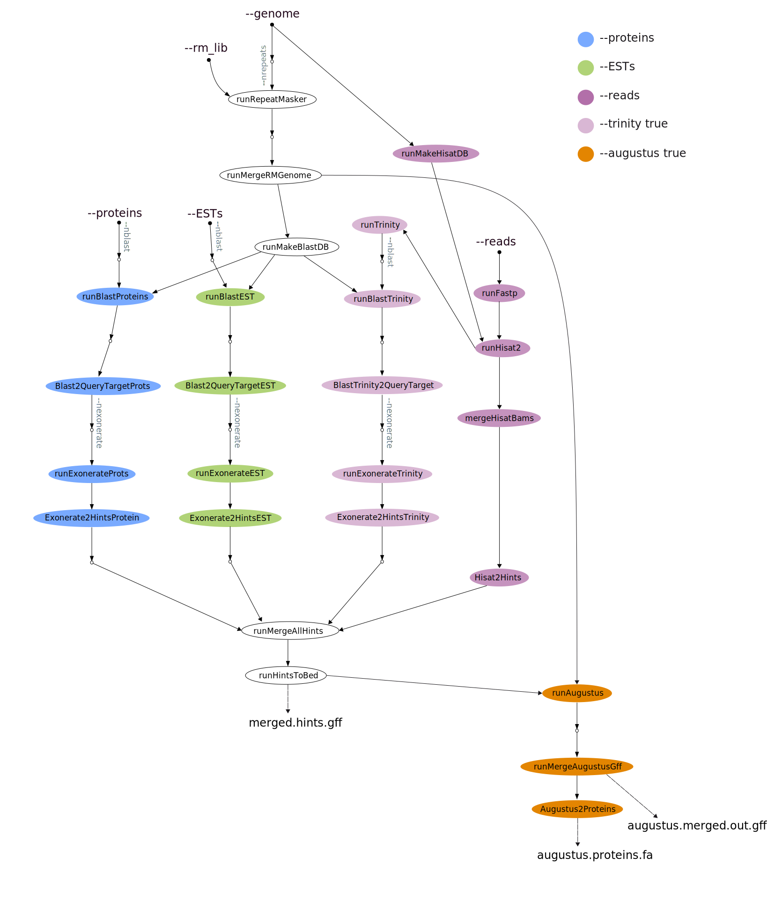

## What happens in this pipeline?
By running `genome-annotation/main.nf` you can generate a a selection of "hints" to guide a subsequent *de novo* annotation of the eukaryotic genome of your choice.
The full pipeline processes data using the following steps for each data type: 

### Proteins:
* **Exonerate**

### ESTs and transcriptome: 
* **Exonerate**

### RNA-seq reads: 
* **Fastp**
* **Hisat2**
* **Trinity** 
* **Exonerate** 

Once a file with all possible extrinsic hints is generated, the following steps are run:

#### `--augustus true`:
* **Augustus** 

 

