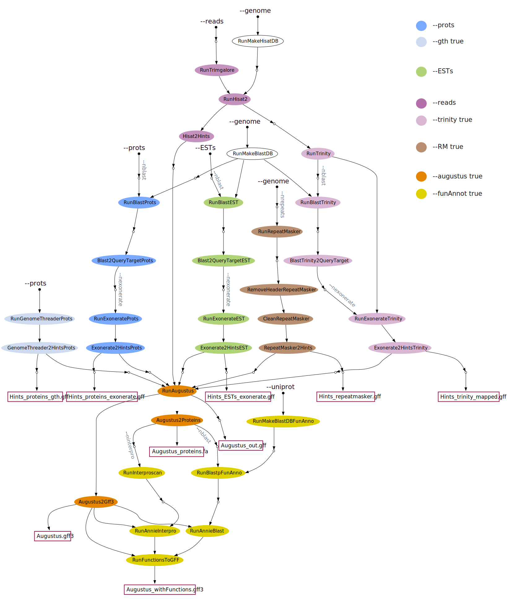

## What happens in this pipeline?
By running `genome-annotation/main.nf` you can generate a *de novo* annotation of the eukaryotic genome of your choice, using different kinds of evidences as extrinsic hints to make the annotation more accurate. The full pipeline processes data using the following steps for each data type: 

### Proteins:
* **Exonerate**
* **GenomeThreader**

### ESTs and transcriptome: 
* **Exonerate**

### RNA-seq reads: 
* **Trimmgalore**
* **Hisat2**
* **Trinity** 
* **Exonerate** 

#### `--RM true`:
* **RepeatMasker** 

Once a file with all possible extrinsic hints is generated, the following steps are run:

#### `--augustus true`:
* **Augustus** 

#### `--funAnnot true`:
* **Blast** 
* **InterProScan**
* **Annie** 

 
